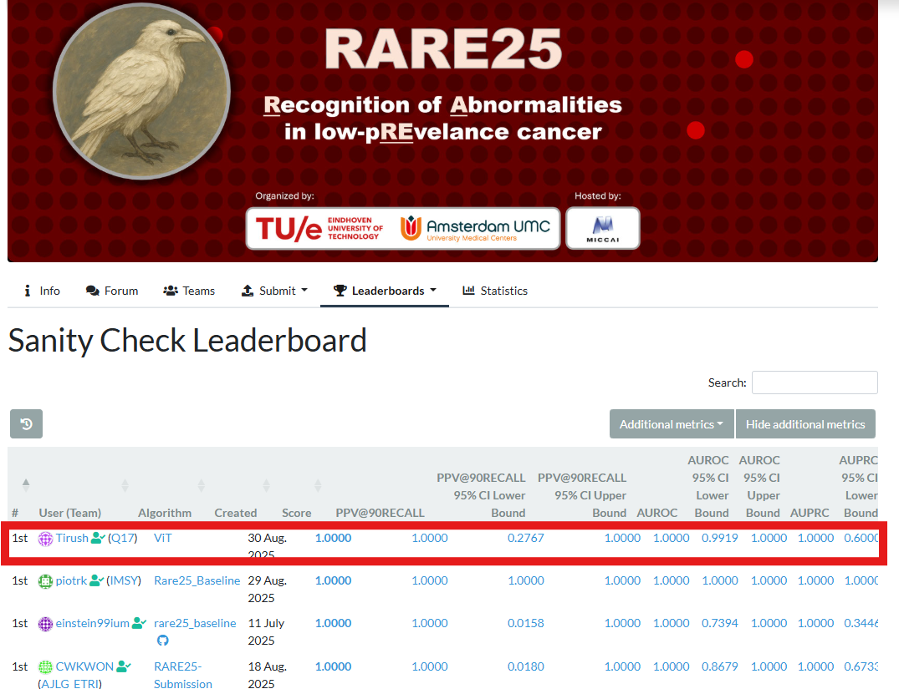
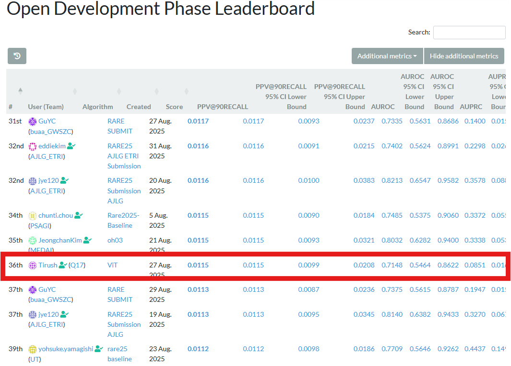

# RARE 2025 Challenge -- Early Cancer Detection

## 📖 Overview

This repository contains my work for the **RARE 2025 Challenge**, part
of **EndoVis**. The focus is detecting **early-stage cancers** in
patients with **Barrett's Esophagus (BE)** during routine endoscopy.
These cases are rare (\<1% prevalence) and subtle, making detection
extremely challenging.

The project implements a **classification system** trained on endoscopic
images to detect early neoplasia in BE, aiming to build a model that
is: - Sensitive enough to catch early cancers - Specific enough to avoid
flooding clinicians with false positives

The system is containerized with **Docker** for easy deployment.

---

## 🎯 Project Goals

-   Develop a **robust classification model** for early-stage cancer in
    BE.
-   Train and evaluate models in a **low-prevalence setting**.
-   Provide a reproducible **benchmark pipeline**.
-   Package the model in a **Docker container** for portability and
    deployment.

---

## 🧑‍⚕️ The Clinical Problem

-   Early BE-associated cancers are **rare (\<1%)** and **difficult to
    detect**.
-   Subtle signs are often missed in real-world practice.
-   Early detection enables endoscopic treatment with \>90% long-term
    success.
-   If missed, progression leads to poor outcomes and \~15% five‑year
    survival rates.

---

## 📊 Dataset & Challenge Context

-   Based on the **RARE 2025 Challenge dataset**, hosted on Hugging
    Face.
-   Highly **imbalanced distribution**: normal/benign cases vastly
    outnumber early neoplasia.
-   Models must strike the **right balance between sensitivity &
    specificity**.

**Dataset Link:**\
[RARE25‑train on Hugging
Face](https://huggingface.co/datasets/TimJaspersTue/RARE25-train)\
Please note: You need to log in and accept contributor conditions to
access the data.

---

## 🏗️ Model Architecture – Vision Transformer (ViT)  
The backbone of this project is a **Vision Transformer (ViT)**, implemented using the **timm** library:  

- **Model Variant:** `vit_base_patch16_224`, pretrained on ImageNet.  
- **Architecture:** Patch-based image embedding (16×16 patches) with multi-head self-attention layers, feed-forward networks, and layer normalization.  
- **Representation:** The `[CLS]` token output from the transformer encoder is used as the global image representation.  
- **Classification Head:** A lightweight projection layer maps the transformer output to binary classes (neoplasia vs. non-neoplasia).  
- **Loss Function:** Weighted cross-entropy to address extreme class imbalance.  
- **Optimization:** Adam with learning rate scheduling for stable convergence.  

This architecture leverages the **global context modeling capability of ViTs**, which is especially important for detecting subtle anomalies in highly imbalanced endoscopic data.  

---

## 🧪 Pre-processing & Data Handling  
To prepare the dataset and mitigate imbalance challenges:  

- **Image Normalization:** Standardized pixel values across samples.  
- **Resizing & Cropping:** Input frames resized to a consistent resolution suitable for the backbone network.  
- **Augmentation:** Applied rotation, flipping, brightness, and color jittering to improve generalization.  
- **Patch Extraction:** Focused sampling of regions-of-interest (ROI) to emphasize subtle lesions.  
- **Class Balancing:** Used weighted sampling and synthetic oversampling of minority class.  
- **Cross-validation:** Ensured robust performance estimation despite small positive class size.  

---

## 🏆 Challenge Progress

The RARE 2025 Challenge is ongoing:

-   **Sanity Check Phase:** 🥇 1st place (as of **06/09/2025**)

[Sanity Check Leaderboard](https://rare25.grand-challenge.org/evaluation/test-submission-debug/leaderboard/)

-   **Open Development Phase:** 📊 36th place (as of **06/09/2025**)

[Open Development Phase Leaderboard](https://rare25.grand-challenge.org/evaluation/open-development-phase/leaderboard/)
---

## 📦 Model Deployment

-   The trained model is packaged in a **Docker image**.\
-   Container exposes an API endpoint per your setup (e.g., REST).\
-   Supports integration into clinical pipelines for testing and
    evaluation.

---

## 📌 Note  
Not all project files are included in this repository at the moment.  
👉 Once the project is fully complete, I will upload **all files and resources** here for reproducibility and open development.  
