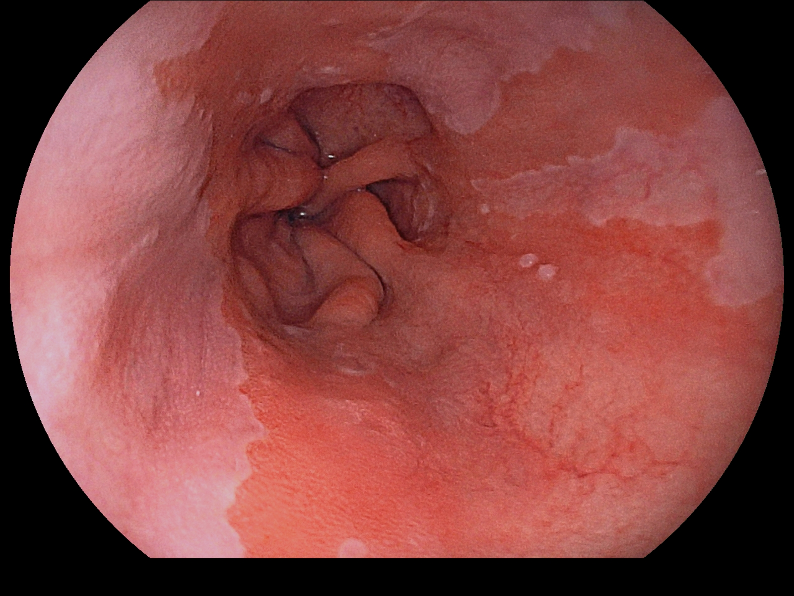
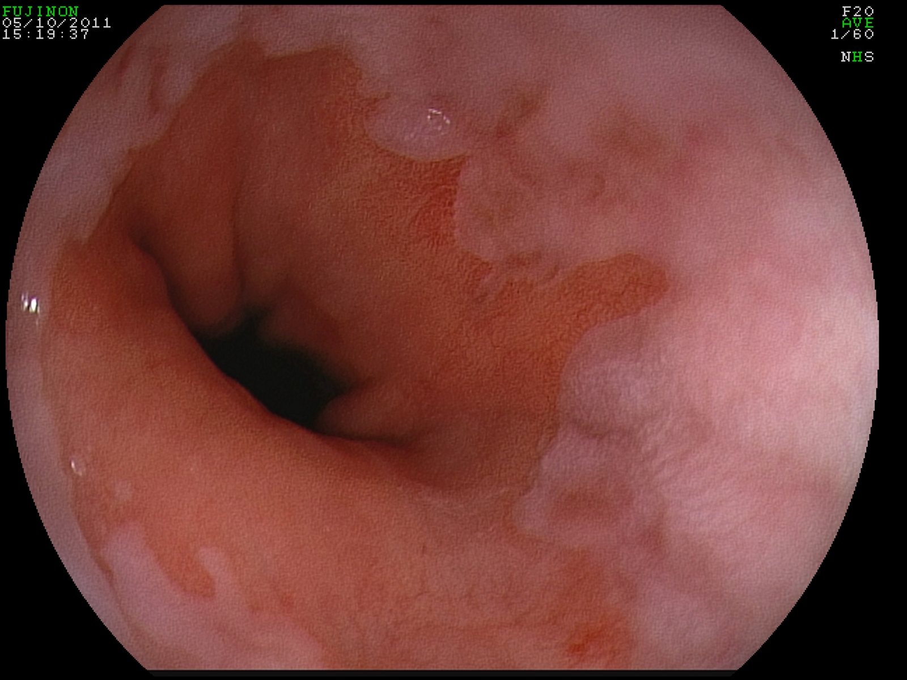
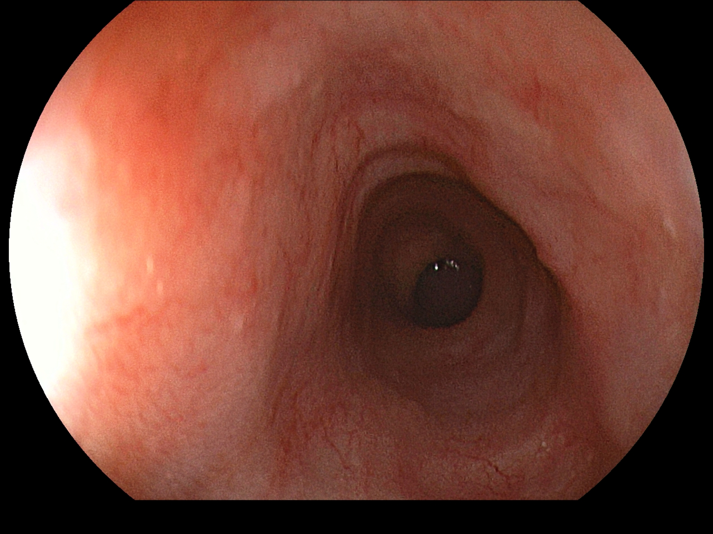
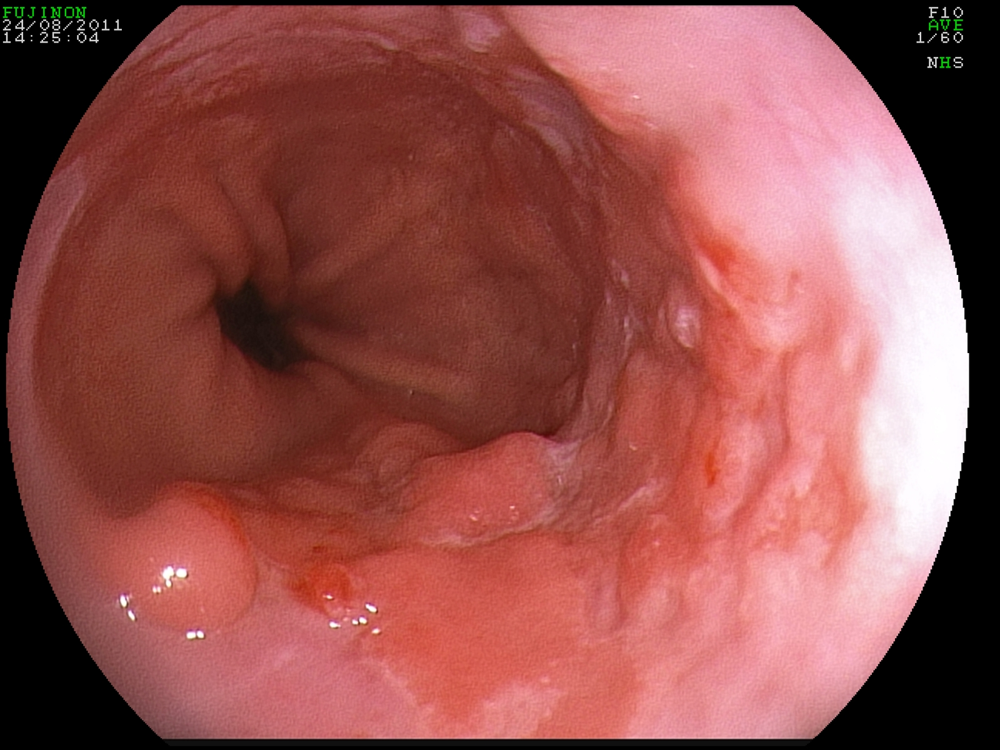
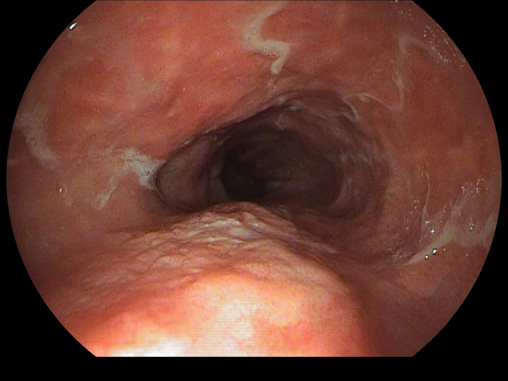
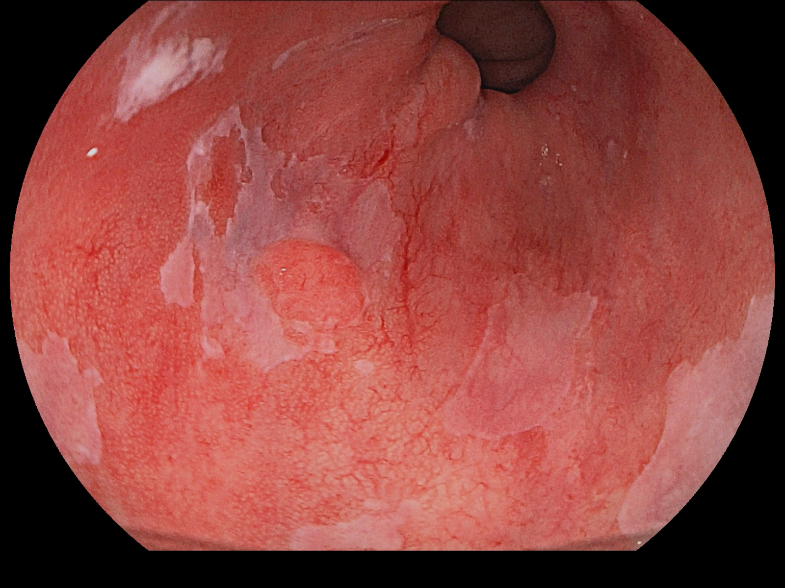
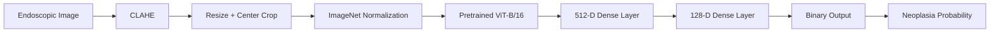

# 🔬 Barrett’s Esophagus Early Cancer Detection — MICCAI RARE25

[](https://www.python.org/)
[](https://pytorch.org/)
[](https://github.com/huggingface/pytorch-image-models)
[](https://www.docker.com/)
[](https://rare25.grand-challenge.org/)

> **Vision Transformer-based classification pipeline for detecting early neoplasia in Barrett’s Esophagus from endoscopic images.**
>
> Developed for the **MICCAI RARE25 Challenge**, with emphasis on class-imbalance handling, transfer learning, and reproducible challenge evaluation.

---

## 🏆 Challenge Results

- **36th globally** — Open Development Phase
- **1st place** — Sanity Check Phase

The Open Development result is used as the primary challenge outcome for this project.

[Open Development Leaderboard](https://rare25.grand-challenge.org/evaluation/open-development-phase/leaderboard/) •
[Sanity Check Leaderboard](https://rare25.grand-challenge.org/evaluation/test-submission-debug/leaderboard/)

---

## 📖 Project Overview

The RARE25 Challenge focuses on detecting **early neoplasia in Barrett’s Esophagus (BE)** from endoscopic images.

This is a difficult classification problem because positive cases are rare and visual abnormalities can be subtle.

The project develops a binary classification pipeline using a pretrained **Vision Transformer (ViT)** together with:

- endoscopic image preprocessing
- imbalance-aware training
- transfer learning
- progressive fine-tuning
- challenge-oriented evaluation

```text
Endoscopic Image
       ↓
Preprocessing
       ↓
Vision Transformer
       ↓
Binary Classification
       ↓
Neoplasia Likelihood
```

---

## 📊 Dataset

The project uses the official **RARE25 training dataset**.

### Dataset Categories

The source dataset contains two main categories:

| Category | Description |
|---|---|
| **NDBT** | Non-dysplastic Barrett’s tissue / non-neoplastic category |
| **ACHD** | Neoplastic / early-cancer category used in the dataset |

The task is treated as a binary classification problem:

```text
NDBT → Non-neoplastic
ACHD → Neoplastic
```

Because neoplastic examples are much less common, class imbalance is a major challenge during training.

### Example Images

Representative images from both categories can be shown to illustrate the visual difficulty of the task.

#### NDBT

<p align="center">
  
  
  
</p>

#### ACHD

<p align="center">
  
  
  
</p>

> Dataset images should only be included when redistribution is permitted by the original dataset access conditions.

**Dataset:**  
[RARE25 Training Dataset — Hugging Face](https://huggingface.co/datasets/TimJaspersTue/RARE25-train)

---

## 🏗️ Model Pipeline


```mermaid
graph LR
    A[Endoscopic Image] --> B[CLAHE]
    B --> C[Resize + Center Crop]
    C --> D[ImageNet Normalization]
    D --> E[Pretrained ViT-B/16]
    E --> F[512-D Dense Layer]
    F --> G[128-D Dense Layer]
    G --> H[Binary Output]
    H --> I[Neoplasia Probability]
```

---

## 🧠 Vision Transformer

The classification model is based on:

```text
vit_base_patch16_224
```

implemented using the **timm** library and initialized with ImageNet-pretrained weights.

### Input

```text
224 × 224 RGB image
```

### Classification Head

```text
ViT Feature Representation
          ↓
Linear → 512
          ↓
ReLU + Dropout
          ↓
Linear → 128
          ↓
ReLU + Dropout
          ↓
Linear → 1
          ↓
Sigmoid Probability
```

The final output represents the estimated likelihood of the positive neoplastic class.

---

## 🧪 Image Preprocessing

The active preprocessing pipeline includes:

1. **CLAHE contrast enhancement**
2. Resize to the target input resolution
3. Center crop
4. Tensor conversion
5. ImageNet normalization

```text
RGB Image
    ↓
CLAHE
    ↓
Resize
    ↓
Center Crop
    ↓
224 × 224
    ↓
ImageNet Normalization
```

CLAHE is applied to improve local contrast in the endoscopic images before ViT inference.

---

## ⚖️ Class-Imbalance Handling

The dataset contains substantially fewer positive examples than negative examples.

Two complementary strategies were used.

### Positive-Class Oversampling

Positive training examples were repeated to increase their representation during optimization.

```text
Positive Class → 3× Training Representation
```

### Weighted Loss

Training uses:

```text
BCEWithLogitsLoss
```

with a positive-class weight derived from the training class distribution.

```text
pos_weight = Negative Samples / Positive Samples
```

This increases the contribution of positive examples to the training loss.

---

## 🏋️ Training Strategy

The pretrained transformer is fine-tuned progressively rather than training the complete backbone from the beginning.

### Progressive Unfreezing

| Stage | Trainable Final ViT Blocks |
|---|---:|
| Initial | 1 |
| Epoch 3 | 2 |
| Epoch 6 | 4 |
| Epoch 10 | 6 |

### Optimization

- **Optimizer:** AdamW
- **Base learning rate:** `1e-3`
- **Weight decay:** `0.05`
- **Layer-wise LR decay:** `0.85`
- **Scheduler:** Cosine decay
- **Warm-up:** 5% of training steps
- **Mixed precision:** Enabled on CUDA
- **EMA:** Used for more stable model evaluation

---

## 📊 Open Development Results

The submitted **Vision Transformer** was evaluated by the RARE25 organizers on the **Open Development test set**.

| Metric | Score | 95% Confidence Interval |
|---|---:|---:|
| **PPV @ 90% Recall** | **0.0115** | 0.0099 – 0.0208 |
| **AUROC** | **0.7148** | 0.5464 – 0.8622 |
| **AUPRC** | **0.0851** | 0.0162 – 0.2727 |

<!-- <p align="center">
  
</p> -->

### Primary Metric

The challenge uses **PPV at 90% recall** as a key evaluation measure for rare-case detection.

This evaluates how precise the system remains while operating at a high sensitivity level.

---

## 🐳 Challenge Submission

RARE25 submissions are evaluated using **Docker-based Grand Challenge containers**.

The inference workflow follows:

```text
Challenge Input
      ↓
Image Loading
      ↓
Preprocessing
      ↓
Model Inference
      ↓
Neoplasia Likelihood
      ↓
Challenge Output
```

Docker packaging ensures that inference executes consistently in the challenge evaluation environment.

---

## 📦 Reproducibility

The repository contains the project materials used during model development and challenge participation.

Full reproduction requires:

- access to the official RARE25 dataset
- corresponding dataset metadata
- trained model weights
- compatible PyTorch and `timm` environments

The challenge dataset itself is not redistributed in this repository.

> **Implementation note:** If the original RARE25 ResNet50 starter `inference.py` remains in the repository, it should be treated as the challenge container template rather than the final ViT training implementation.

---

## ⚠️ Research Use Disclaimer

This project was developed for **research and challenge evaluation**.

It is not a medical device and should not be used for clinical diagnosis, screening, treatment, or patient-management decisions.

---

## 🤝 Acknowledgements

- **MICCAI / EndoVis / RARE25 Challenge** — challenge organization and evaluation
- **Grand Challenge** — challenge infrastructure
- **Hugging Face** — dataset hosting
- **PyTorch** — deep learning framework
- **timm** — pretrained Vision Transformer implementation
- **OpenCV** — image preprocessing
- **Docker** — submission packaging

---

## 👤 Author

**Tirush Dumil Wickramasingha**

[GitHub](https://github.com/Tirush-Leo) •
[LinkedIn](https://www.linkedin.com/in/tirush-dumil/) •
[Google Scholar](https://scholar.google.com/citations?user=WRrjwsoAAAAJ&hl=en)
