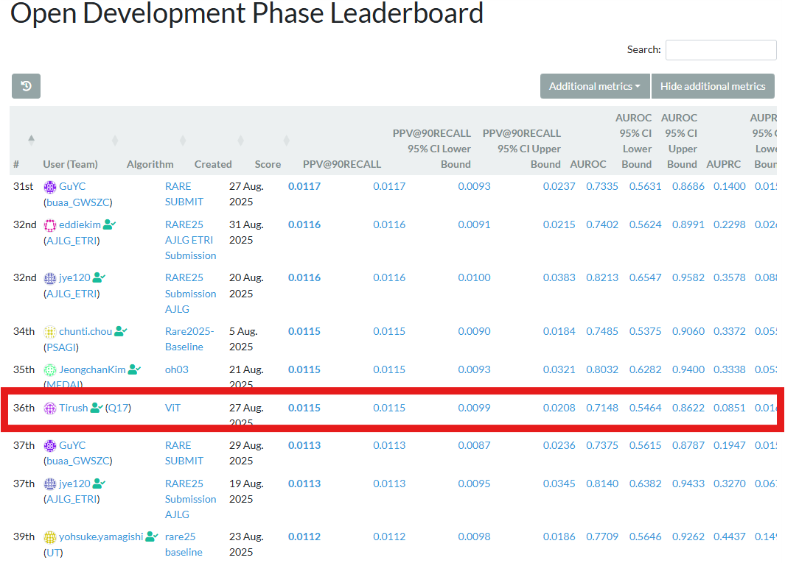
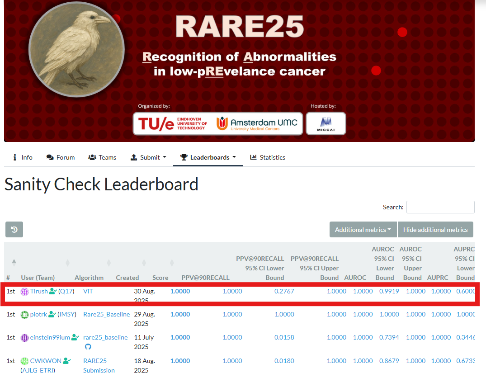
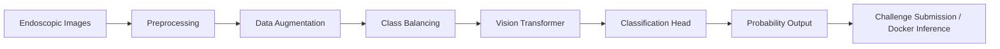

# 🔬 Barrett’s Esophagus Early Cancer Detection — MICCAI RARE25 Challenge

> **Vision Transformer-based classification pipeline for early-stage Barrett’s esophagus cancer detection from endoscopic images.**
>
> Developed for the **MICCAI RARE25 Challenge**, this project focuses on robust endoscopic image classification under extreme class imbalance, with emphasis on preprocessing, augmentation, imbalance-aware training, and Dockerized challenge submission.

---

## 🏆 Challenge Results

This project was developed and submitted as part of the **MICCAI RARE25 Challenge**.

### Reported Outcomes

- **36th globally** in the **Open Development Phase**
- **1st place** in the **Sanity Check Phase**

The portfolio emphasis is placed on the **Open Development Phase ranking**, while the Sanity Check result is included as an early development milestone.

  

  

- [Open Development Phase Leaderboard](https://rare25.grand-challenge.org/evaluation/open-development-phase/leaderboard/)
- [Sanity Check Leaderboard](https://rare25.grand-challenge.org/evaluation/test-submission-debug/leaderboard/)

---

## 📖 Project Overview

Barrett’s Esophagus (BE) is a premalignant condition that can progress to esophageal adenocarcinoma. Detecting **early neoplasia** during routine endoscopy is clinically important, but also highly challenging because suspicious cases are:

- **rare**
- **subtle**
- visually variable
- easily confused with non-neoplastic tissue

This project develops an image-classification pipeline for **early cancer detection in Barrett’s Esophagus** using endoscopic images.

The system was designed to address three major challenges:

1. **Low prevalence of positive cases**
2. **Subtle visual abnormalities**
3. **The need for a practical and reproducible challenge-submission workflow**

The final solution uses a **Vision Transformer (ViT)** backbone together with preprocessing, augmentation, and imbalance-aware training strategies.

---

## 🧑‍⚕️ Clinical Context

Early Barrett’s-associated neoplasia is difficult to detect in real-world endoscopy because relevant visual cues can be small and subtle.

From a clinical perspective:

- missed early lesions may delay treatment
- early detection can enable endoscopic intervention
- highly imbalanced prevalence makes model development difficult
- a useful model must balance **sensitivity** and **specificity**

This challenge setting therefore requires models that are not only accurate, but also robust under severe class imbalance.

---

## 📊 Dataset & Challenge Context

This work is based on the **RARE25 Challenge dataset**, provided through the official challenge platform.

### Dataset Characteristics

- Endoscopic images for Barrett’s Esophagus analysis
- Binary classification setting:
  - **Neoplasia**
  - **Non-neoplasia**
- Strong class imbalance
- Small proportion of positive / early-cancer examples

### Access Note

The challenge data is not redistributed through this repository.

To access the dataset, please use the official source and accept the required access conditions:

🔗 [RARE25-train on Hugging Face](https://huggingface.co/datasets/TimJaspersTue/RARE25-train)

---

## 🏗️ System Pipeline

The project follows a structured classification workflow:

```mermaid
graph LR
    A[Endoscopic Images] --> B[Preprocessing]
    B --> C[Data Augmentation]
    C --> D[Class Balancing]
    D --> E[Vision Transformer]
    E --> F[Classification Head]
    F --> G[Probability Output]
    G --> H[Challenge Submission / Docker Inference]
```

---

## 🧠 Model Architecture

The backbone of the project is a **Vision Transformer (ViT)** implemented using the **timm** library.

### Model Configuration

- **Backbone:** `vit_base_patch16_224`
- **Pretraining:** ImageNet
- **Patch Size:** 16 × 16
- **Global Representation:** `[CLS]` token
- **Task:** Binary classification
- **Output Classes:**
  - Neoplasia
  - Non-neoplasia

### Architecture Summary

The model uses:

- patch-based image embedding
- transformer encoder layers
- multi-head self-attention
- feed-forward layers
- layer normalization
- lightweight classification head

This architecture was selected for its ability to model **global context**, which is useful for capturing subtle and spatially distributed visual patterns in endoscopic images.

---

## 🧪 Preprocessing & Data Handling

To improve robustness and support model learning, the training pipeline included several preprocessing and augmentation strategies.

### Preprocessing

- image normalization
- resizing to a consistent input resolution
- cropping / framing adjustments where needed
- preparation of images for ViT-based inference

### Data Augmentation

To improve generalization under limited positive data, augmentation techniques included:

- rotation
- horizontal / vertical flipping
- brightness variation
- color jittering

These transformations were intended to improve robustness to lighting, viewpoint, and tissue-appearance variability.

---

## ⚖️ Class-Imbalance Handling

A central challenge of the dataset was the **extreme imbalance** between neoplastic and non-neoplastic cases.

To address this, the training pipeline incorporated:

- **weighted cross-entropy loss**
- **weighted sampling**
- stronger exposure of minority-class examples during training

This helped reduce bias toward the majority class and improve the model’s ability to learn from rare positive samples.

---

## 🏋️ Training Strategy

The model development process focused on stable optimization and robust estimation under data scarcity.

### Training Components

- Vision Transformer backbone
- weighted cross-entropy loss
- Adam optimizer
- learning-rate scheduling
- augmentation-driven regularization
- cross-validation during experimentation

### Development Focus

The pipeline was designed to improve:

- robustness to rare positive cases
- sensitivity to subtle visual abnormalities
- generalization under limited class-positive data
- reproducibility of inference and challenge submission

---

## 📈 Project Outcome

The final project demonstrated that a **Vision Transformer-based classification pipeline**, combined with preprocessing and imbalance-aware training, can provide a practical approach for early Barrett’s esophagus cancer detection in a challenge setting.

### Key Project Strengths

- ViT-based global-context modeling
- targeted preprocessing and augmentation
- class-imbalance-aware optimization
- reproducible Docker submission workflow
- external benchmark evaluation through the MICCAI RARE25 Challenge

---

## 🐳 Docker Submission Workflow

The final submission was packaged inside a **Docker container** to ensure consistent inference behavior during challenge evaluation.

### Submission Workflow

1. Load trained model weights
2. Preprocess challenge input images
3. Run model inference
4. Generate prediction probabilities / labels
5. Format outputs according to challenge requirements
6. Execute inside Docker for reproducible submission

This Dockerized workflow supported portability and consistent challenge evaluation.

---

## 📦 Reproducibility

This repository contains the main project materials for the **RARE25 challenge workflow**.

Full reproduction of training results may require:

- access to the official challenge dataset
- acceptance of challenge data conditions
- the same train/validation split strategy used during development
- the same training and augmentation configuration used during experimentation

Because challenge datasets are access-controlled, the dataset itself is **not included** in this repository.

---

## ⚠️ Limitations

This work was developed for a **challenge / research setting** and has several limitations:

- strong class imbalance
- limited number of positive examples
- possible dataset-specific bias
- performance may vary under different clinical acquisition conditions
- challenge performance does not imply direct clinical readiness

This project should therefore be interpreted as a **research and benchmark-oriented system**, not as a clinical diagnostic tool.

---

## 🚀 Future Work

Possible next steps include:

- testing stronger transformer variants
- improved lesion-focused region modeling
- better interpretability / explainability
- more advanced imbalance-aware learning strategies
- calibration-focused evaluation
- external validation on additional endoscopy datasets
- comparison with CNN-based baselines under identical settings

---

## 🤝 Acknowledgements

- **MICCAI / EndoVis / RARE25 Challenge** — challenge organization and evaluation framework
- **Hugging Face** — challenge dataset hosting
- **timm** — Vision Transformer implementation
- **PyTorch** — model development framework
- **Docker** — portable inference and submission packaging

---

## 👤 Author

**Tirush Dumil Wickramasingha**

[GitHub](https://github.com/Tirush-Leo) •
[LinkedIn](https://www.linkedin.com/in/tirush-dumil/) •
[Google Scholar](https://scholar.google.com/citations?user=WRrjwsoAAAAJ&hl=en)
